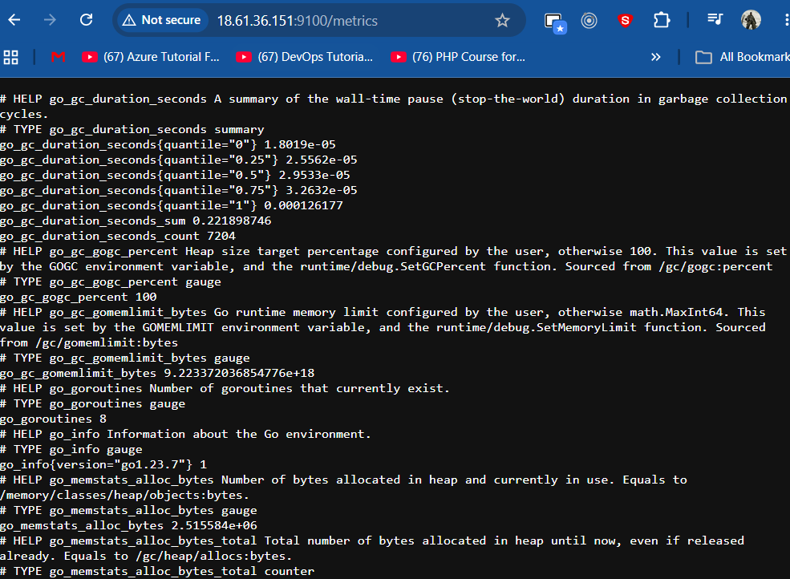
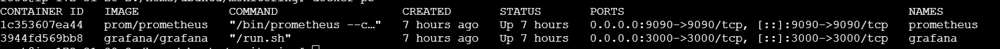
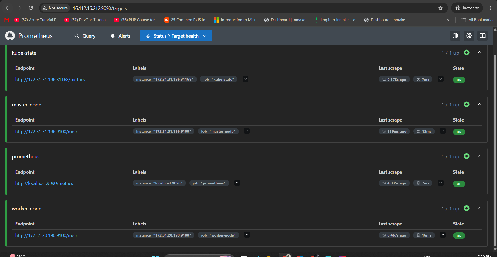
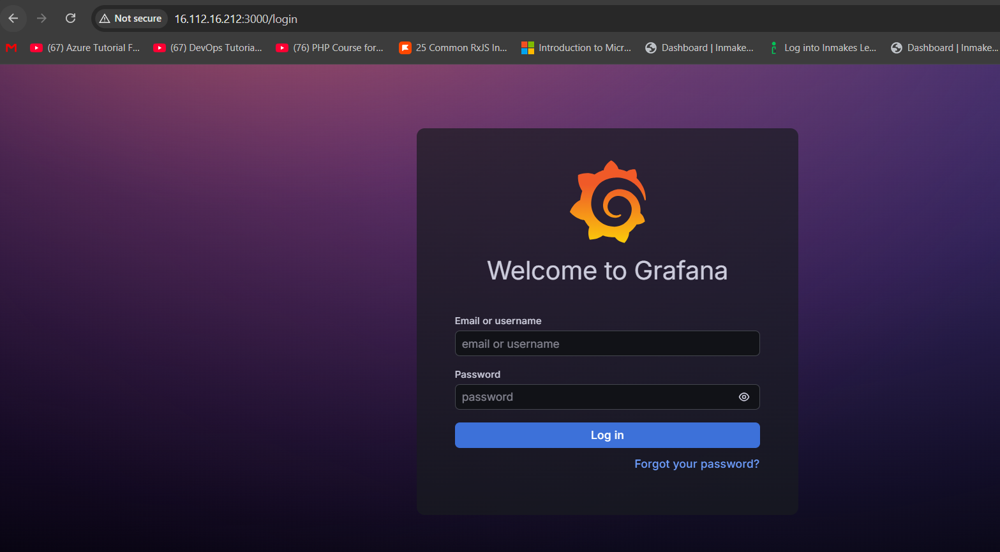
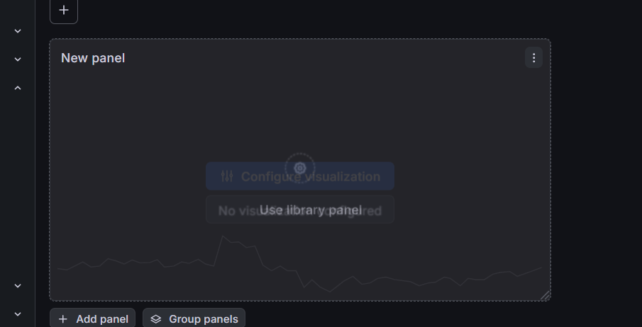
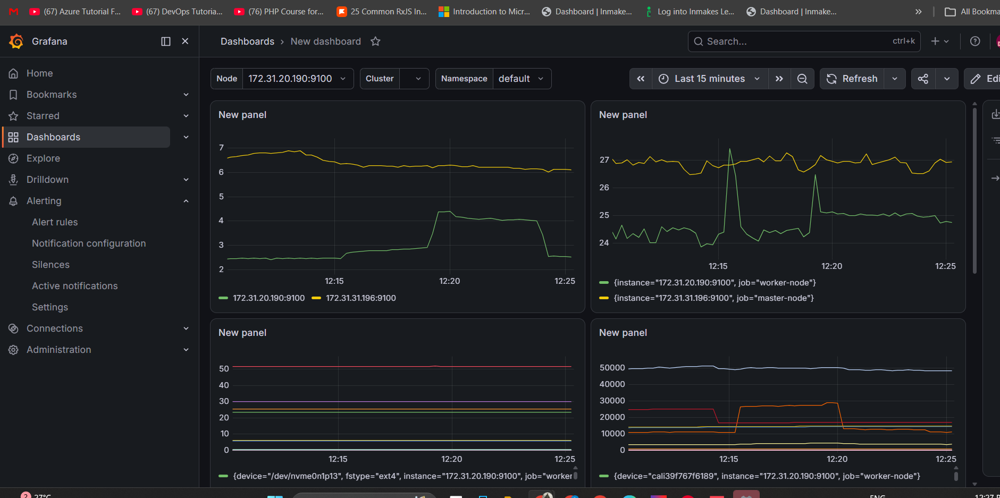
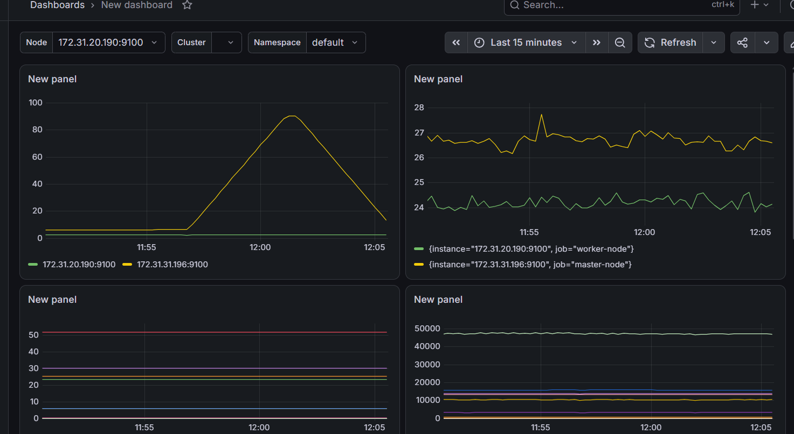
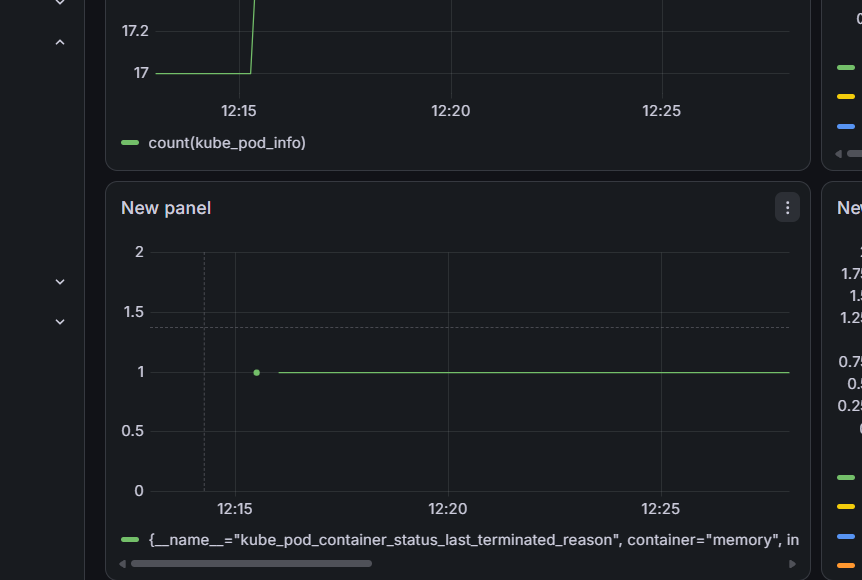
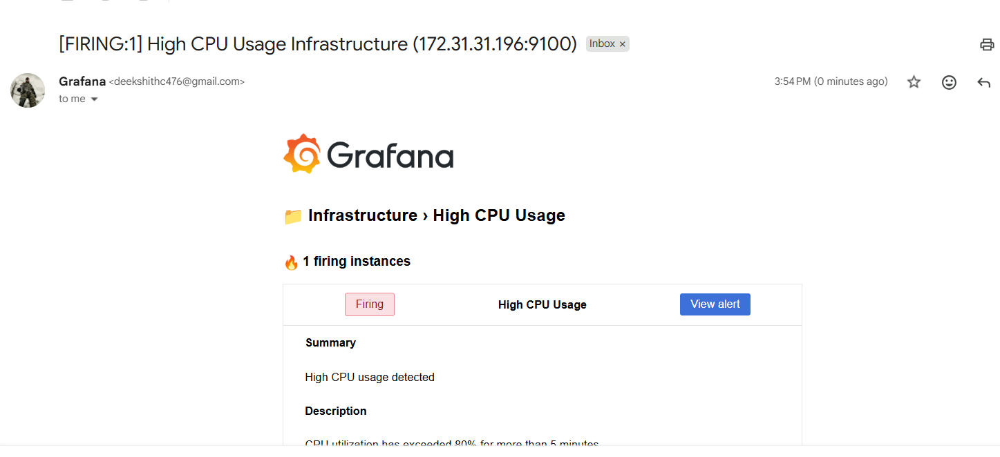

# **Kubernetes Monitoring Stack with Prometheus & Grafana on AWS**

*A complete guide to setting up a monitoring stack for a Kubernetes cluster on AWS using Prometheus, Grafana, Node Exporter, and Docker Compose.*

## 📖 Architecture
```

                    AWS
        +---------------------------+
        |   Monitoring Server       |
        |---------------------------|
        | Docker                    |
        | Prometheus                |
        | Grafana                   |
        | Alertmanager (Optional)   |
        +------------+--------------+
                     |
               Scrape Metrics
                     |
      -----------------------------------
      |                                 |
+-------------+                 +-------------+
| ControlPlane|                 | Worker Node |
| Kubespray   |                 | Kubernetes  |
| kubelet     |                 | kubelet     |
| NodeExporter|                 | NodeExporter|
| cAdvisor    |                 | cAdvisor    |
+-------------+                 +-------------+
```

## 🚀 Prerequisites

- AWS EC2 Instances
- Ubuntu 22.04 (Recommended)
- Docker & Docker Compose
- Kubernetes Cluster (Kubespray or kubeadm)
- Internet connectivity

## 🖥 Infrastructure

- Server	IP Address	Purpose
- Monitor	172.31.10.10	Prometheus + Grafana
- Master	172.31.10.20	Kubernetes Control Plane
- Worker	172.31.10.30	Kubernetes Worker Node

## 🔓 AWS Security Group

Allow the following inbound ports.

- Port ----- Purpose
- 3000 ----- Grafana
- 6443 ----- Kubernetes API
- 9090 ----- Prometheus
- 9100 ----- Node Exporter
- 10250 ---- kubelet Metrics

### Step 1 – Install Docker on Monitoring Server

### Step 2 – Create Monitoring Directory
- mkdir ~/monitoring

- cd ~/monitoring

- mkdir prometheus

- mkdir grafana

- mkdir alertmanager

### Step 3 – Install Node Exporter
**Run the following on both Master and Worker nodes.**

- Download
  - wget https://github.com/prometheus/node_exporter/releases/latest/download/node_exporter-1.9.1.linux-amd64.tar.gz

- Extract
  - tar -xvf node_exporter-*.tar.gz

- Move Binary
  - sudo mv node_exporter-*/node_exporter /usr/local/bin/

- Create User
  - sudo useradd --no-create-home node_exporter

- Create Service
  - sudo nano /etc/systemd/system/node_exporter.service

- Paste:
```
[Unit]
Description=Node Exporter

[Service]
User=node_exporter
ExecStart=/usr/local/bin/node_exporter

[Install]
WantedBy=default.target
```
- Reload and start:


  - sudo systemctl daemon-reload

  - sudo systemctl enable node_exporter

  - sudo systemctl start node_exporter

- Verify:

  - http://MASTER-IP:9100/metrics

  - http://WORKER-IP:9100/metrics
    
   

### Step 4 – Configure Prometheus
- Create configuration file.

- mkdir -p prometheus

- nano prometheus/prometheus.yml
```
global:
  scrape_interval: 15s

scrape_configs:

  - job_name: prometheus
    static_configs:
      - targets:
          - localhost:9090

  - job_name: node-exporter
    static_configs:
      - targets:
          - 172.31.10.20:9100
          - 172.31.10.30:9100

  - job_name: kubernetes
    scheme: https

    tls_config:
      insecure_skip_verify: true

    static_configs:
      - targets:
          - 172.31.10.20:10250
```

### Step 5 – Create Docker Compose
  - nano docker-compose.yml

```
services:
  prometheus:
    image: prom/prometheus
    container_name: prometheus
    ports:
      - "9090:9090"
    volumes:
      - ./prometheus/prometheus.yml:/etc/prometheus/prometheus.yml
    restart: unless-stopped

  grafana:
    image: grafana/grafana
    container_name: grafana
    ports:
      - "3000:3000"
    volumes:
      - ./grafana:/var/lib/grafana
    environment:
      GF_SMTP_ENABLED: "true"
      GF_SMTP_HOST: "smtp.gmail.com:587"
      GF_SMTP_USER: "<user/company email>"
      GF_SMTP_PASSWORD: "<gmail app password>"
      GF_SMTP_FROM_ADDRESS: "myalerts@gmail.com"
      GF_SMTP_FROM_NAME: "Grafana"
    restart: unless-stopped
```

### Step 6 – Start Monitoring Stack
- docker compose up -d

Verify:

 - docker ps


### Step 7 – Verify Prometheus
- Open:

  - http://Monitor-IP:9090
    

- Navigate to:

  - Status → Targets

- Expected:



### Step 8 – Access Grafana
- Open:

  - http://Monitor-IP:3000
  

- Default credentials:

  - Username: admin
  - Password: admin

- Change the password after the first login.

### Step 9 – Connect Grafana to Prometheus
- Navigate to:

- Connections
→ Data Sources
→ Add Data Source
→ Prometheus

- Prometheus URL:

  - http://prometheus:9090

- Click:

  - Save & Test

### Step 10 – Create Dashboard

 

### Step 11 – Useful PromQL Queries

- CPU Usage
```
100 - (avg by(instance)(irate(node_cpu_seconds_total{mode="idle"}[5m])) * 100)
```
- Memory Usage
```
(
node_memory_MemTotal_bytes -
node_memory_MemAvailable_bytes
)
/
node_memory_MemTotal_bytes
*100
```
- Disk Usage
```
100 -
(
node_filesystem_avail_bytes
/
node_filesystem_size_bytes
*100
)
```

- Network Traffic
```
rate(node_network_receive_bytes_total[5m])
```
- Pod Count
```
count(kube_pod_info)
```

- Restart Count
```
kube_pod_container_status_restarts_total
```

- Node Health
```
up
```

- OOMKilled Pods
```
kube_pod_container_status_last_terminated_reason{reason="OOMKilled"}
```

### Step 12 – Dashboard Variables

- Create variables under:

- Dashboard
→ Settings
→ Variables

- Cluster
```
label_values(up,cluster)
```

- Namespace
```
label_values(kube_pod_info,namespace)
```

- Node
```
label_values(node_cpu_seconds_total,instance)
```
- Panels can now use:

$Cluster
$Namespace
$Node

### Step 13 – Alert Rules

- High CPU
```
100-(avg by(instance)(irate(node_cpu_seconds_total{mode="idle"}[5m]))*100)>80
```

- Duration:

  - 5m

- High Memory
```
(
node_memory_MemTotal_bytes -
node_memory_MemAvailable_bytes
)
/
node_memory_MemTotal_bytes
*100 >80
```

- Node Down
```
up == 0
```

- Pod Restart
```
increase(kube_pod_container_status_restarts_total[5m]) > 0
```

- OOMKilled
```
kube_pod_container_status_last_terminated_reason{reason="OOMKilled"} == 1
```
 


### Step 14 – Configure Email Alerts

- Navigate to:

- Grafana
→ Alerts
→ Contact Points
→ Add Contact Point
→ Email

Configure SMTP in grafana.ini or via Docker environment variables, then test the contact point.

### Step 15 – Simulate High CPU

- Install the stress utility:

  - sudo apt install stress -y

- Generate CPU load:
```
stress --cpu 4 --timeout 300
```

- CPU usage should exceed 80%, triggering the configured alert after the evaluation period.

 


### Step 16 – Simulate Pod Restart

- Create crash-test.yaml.

```
apiVersion: v1
kind: Pod

metadata:
  name: crash-test

spec:
  containers:
  - name: crash
    image: busybox
    command: ["/bin/sh","-c","exit 1"]

  restartPolicy: Always
```
- Deploy:
```
kubectl apply -f crash-test.yaml
```
- The pod will continuously restart, increasing:

  - kube_pod_container_status_restarts_total


### Step 17 – Simulate OOMKilled

- Create oom-test.yaml.

```
apiVersion: v1
kind: Pod

metadata:
  name: oom-test

spec:
  containers:
  - name: memory
    image: polinux/stress

    resources:
      limits:
        memory: "100Mi"

    command:
      - stress
      - --vm
      - "1"
      - --vm-bytes
      - "200M"
      - --vm-hang
      - "1"
```
Deploy:

```
kubectl apply -f oom-test.yaml
```
This pod exceeds its memory limit, causing an OOMKilled event that can trigger the configured alert.

 


📁 Project Structure
```
monitoring/
├── docker-compose.yml
├── prometheus/
│   └── prometheus.yml
├── grafana/
└── alertmanager/
```

✅ Expected Outcome


- After completing this setup, you will have:

  
*Designed and implemented a scalable Kubernetes monitoring solution using Prometheus, Grafana, Node Exporter, and kubelet metrics to provide comprehensive infrastructure observability. Developed interactive dashboards for monitoring CPU, memory, disk, network, pod health, container restarts, and OOMKilled events, while enabling configurable email alerts for proactive incident detection. The monitoring stack is built with production readiness in mind and can be seamlessly extended with Alertmanager and additional exporters to support advanced alerting and broader infrastructure monitoring.*
