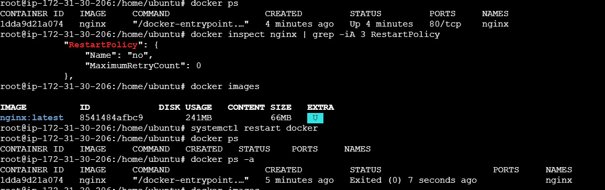
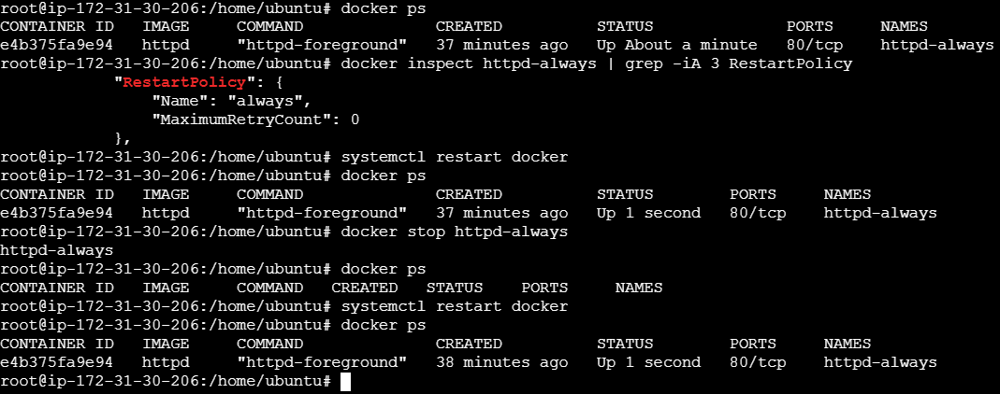
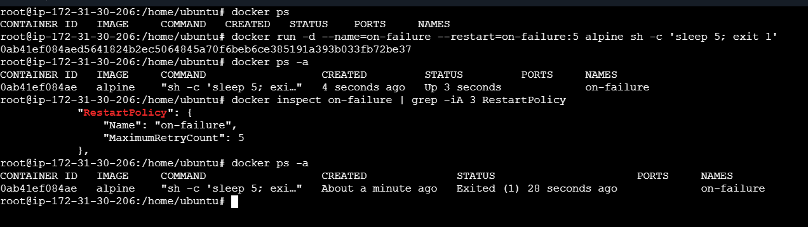

## Restart policies in docker

To make an application available and ensure that it restarts when needed, Docker provides restart policies. A restart policy can be specified when creating a container or updated for a running container.

A container may need to restart due to:
- Application failure
- Container failure
- System restart
- Other unexpected failures

### None (Default)
By default, the restart policy is set to none. If an error occurs or the container stops, Docker does not automatically restart the container.

  

### Always
The `always` restart policy restarts the container whenever it stops or goes down. It is useful for applications that need to be continuously available and helps minimize downtime.

`docker run -d --name=httpd-always --restart=always httpd` 

### Unless-stopped
 The `unless-stopped` restart policy restarts the container whenever it stops or goes down, unless the container was explicitly stopped by the user.

If the Docker daemon or system restarts, the container will be started again, as long as it was not explicitly stopped.

`docker run -d --name=unless-stopped --restart=unless-stopped httpd`

###  On-Failure
The `on-failure` restart policy restarts the container only when the container exits with a non-zero exit code, which usually indicates an error or failure.

It does not restart the container when it exits successfully with an exit code of 0.

You can also specify the maximum number of restart attempts:
`docker run -d --name=on-failure --restart=on-failure:5 httpd`

## Update Restart Policy
You can update the restart policy of an existing container using the docker update command.

For example, to change the restart policy of a running container to always:

`docker update --restart=always <container_name>`

For example:

`docker update --restart=unless-stopped httpd-always`

You can verify the restart policy using:

`docker inspect -f '{{.HostConfig.RestartPolicy.Name}}' <container_name>`

For example:

`docker inspect -f '{{.HostConfig.RestartPolicy.Name}}' httpd-always`

## Image Tags
`docker build -t myapp:1.0 .`
Use specific version tags instead of `latest` for development and production. This makes deployments predictable because you know exactly which image version is being used.

**Note**: `latest` is just a tag name; it does not necessarily mean the newest version.

### Dangling Images
Dangling images are unused images without a repository or tag. They are often created when an image is rebuilt and the old image is no longer referenced.

To list dangling images:
`docker images -f dangling=true`
To remove them:
`docker image prune`
Skip the confirmation prompt with:
`docker image prune -f`

**Note**: `docker image prune` removes dangling images by default, not all unused images.