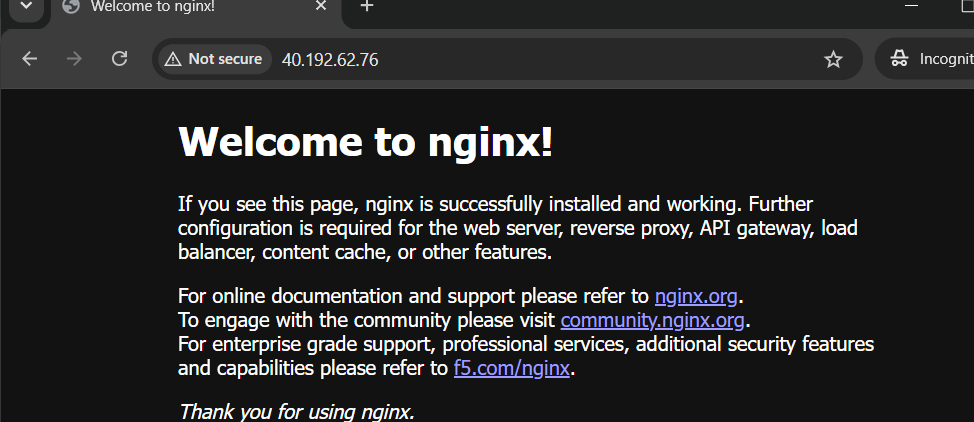
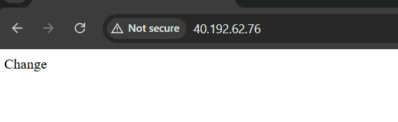
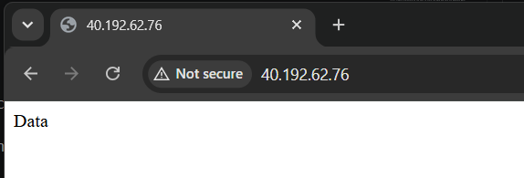
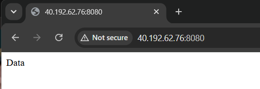

### Without any volume 
```
docker run -d --name=<container-name> -p 80:80 <image>
```
`docker run -d --name=nginx -p 80:80 nginx`



---
Update the nginx home page
```
docker exec -it <container-name> /bin/bash
cd usr/share/nginx/html
echo "Hello" > index.html
```


If you remove the container, the data stored inside the container is also lost:
```
docker rm -f<container-name>
```

### Bind Mount 
A bind mount allows you to store container data in a specific directory on the host machine.

First, create a directory on the host to store the data and note its absolute path:

```
mkdir data
cd data
pwd
```
The `pwd` command displays the absolute path of the directory.

Now, create the container and mount the host directory to a directory inside the container:
```
docker run -d --name=<container-name> -p 80:80  -v <host-path>:/usr/share/nginx/html nginx
```
For example:`docker run -d --name=nginx -p 80:80  -v /home/user/data:/usr/share/nginx/html nginx`
#### Update the Nginx Home Page

Access the running container and update `index.html`:
```
docker exec -it <container-name> /bin/bash
cd usr/share/nginx/html
echo "Hello" > index.html
```


#### Sharing the Same Bind Mount Between Containers

Run another container and mount the same host directory. This allows both containers to access the same data:

```
docker run -d --name=<container-name> -p 8080:80  -v <host-path>:/usr/share/nginx/html nginx
```


Because both containers use the same host directory, changes made to index.html are reflected in both containers.

```
<!DOCTYPE html>
<html lang="en">
<head>
    <meta charset="UTF-8">
    <meta name="viewport" content="width=device-width, initial-scale=1.0">
    <title>My Nginx Server</title>
</head>
<body>
    <h1>Hello from Nginx!</h1>
    <p>This page is being served from a Docker container.</p>
    <p>Container: webserver1</p>
</body>
</html>
```
After modifying `index.html`, the updated content will be visible from both Nginx containers.

